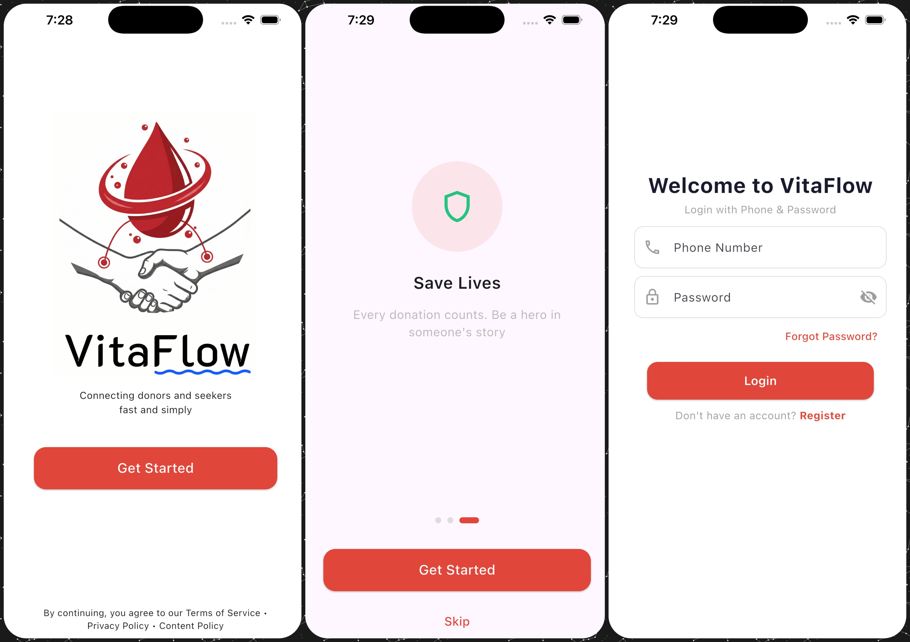
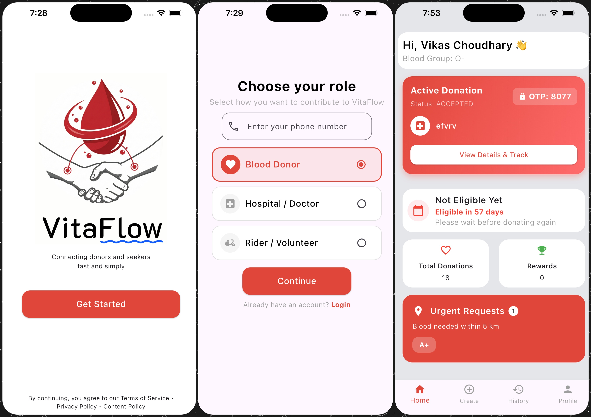
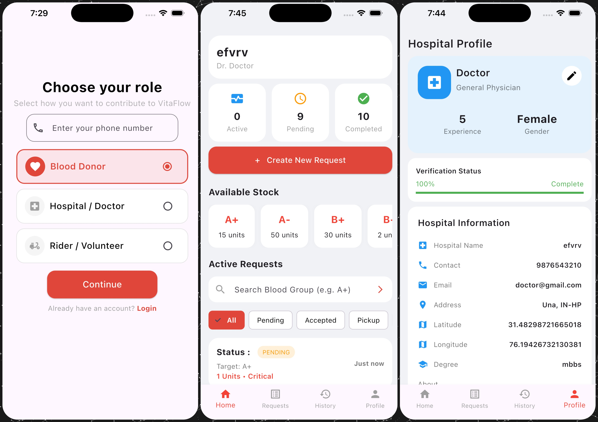
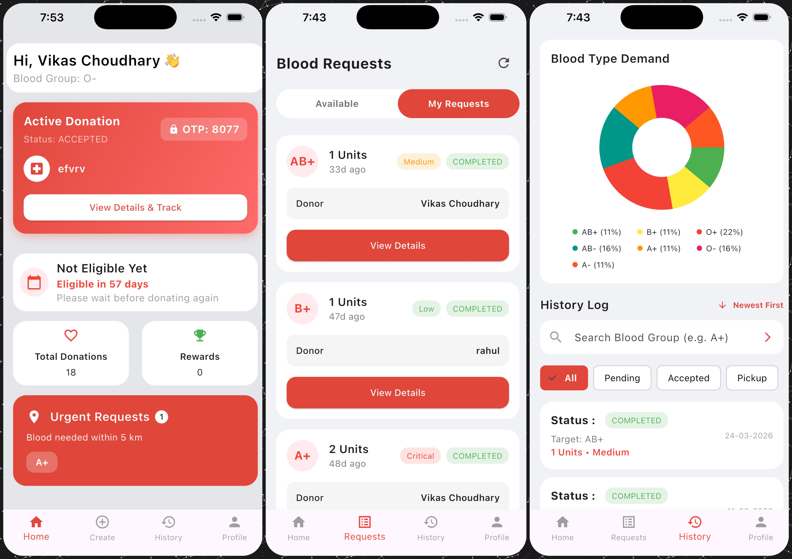
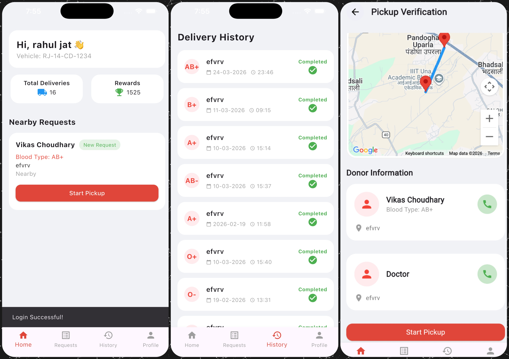
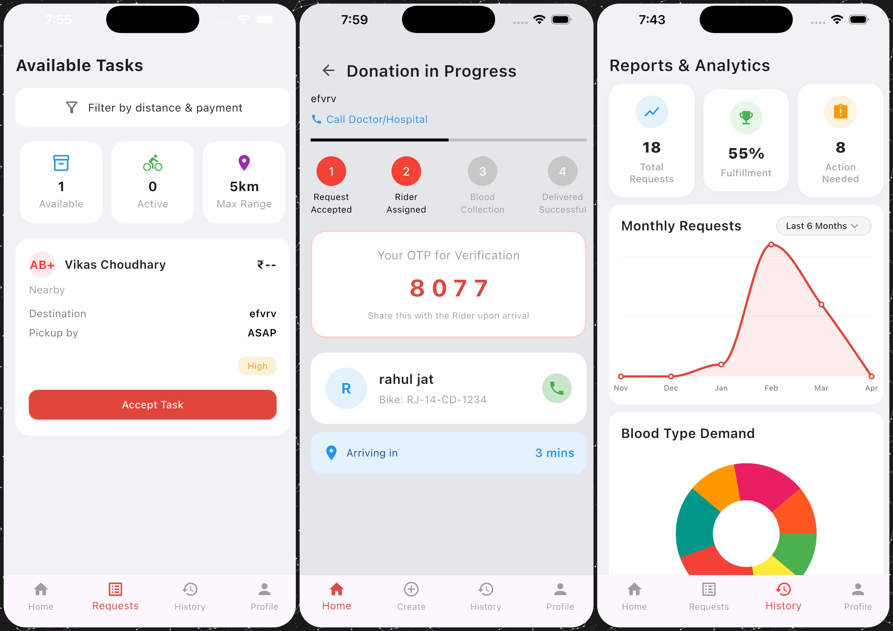
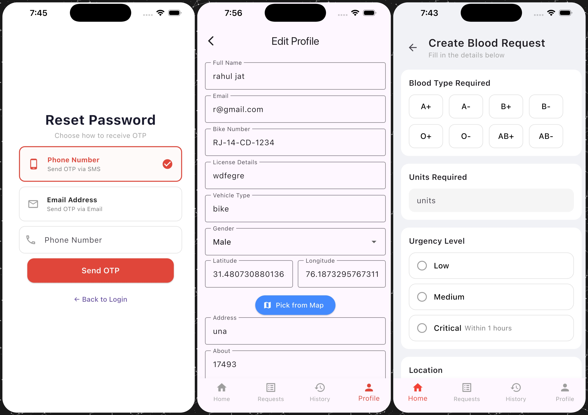
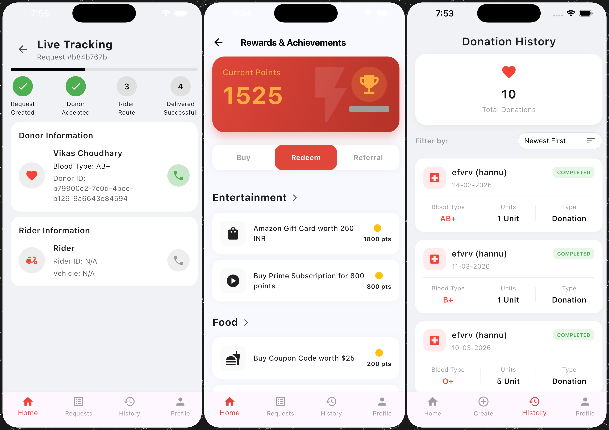
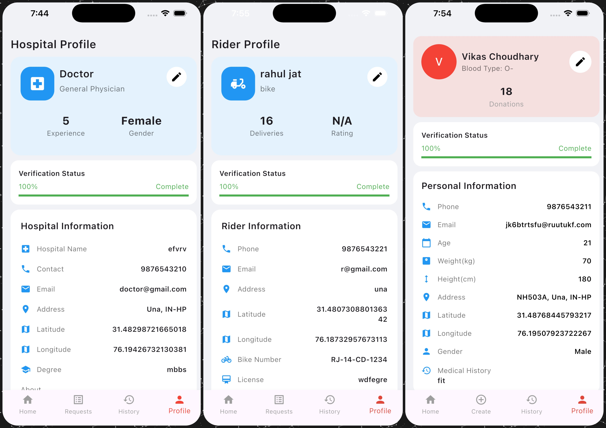

# 🩸 VitaFlow — Smart Blood Donation & Delivery System

> A real-time, role-based platform that connects **Donors, Doctors, and Riders** to ensure fast and reliable blood delivery.

---

## 🚨 Problem Statement

Traditional blood donation systems suffer from:
- Lack of real-time coordination  
- Delayed emergency response  
- No proper tracking of delivery  

---

## 💡 Solution

VitaFlow provides:
- Smart matching between donors and requests  
- Rider-based delivery system  
- Real-time tracking  
- Secure OTP-based verification  

---

## 🧠 Core Idea

This is not just a CRUD app. It combines:
- Location-based matching  
- Multi-role workflows  
- Logistics tracking  
- Real-world emergency handling  

---

## ⚙️ System Architecture

```
Flutter App (Frontend)
        ↓
 REST API (Spring Boot)
        ↓
 PostgreSQL Database
```

---

## 👥 User Roles

### 🧑‍⚕️ Doctor
- Create blood requests  
- Track delivery  
- View history  

### 🧑 Donor
- View nearby requests  
- Accept and donate  
- Track contributions  

### 🚴 Rider
- Accept delivery tasks  
- Pickup and deliver blood  
- Verify delivery using OTP  

---

## ✨ Features

- 🔐 OTP Authentication (SMS)  
- 📍 Real-Time Location Tracking (Google Maps)  
- 🔄 Smart Matching System  
- 📦 Delivery Lifecycle Tracking  
- 📊 Role-Based Dashboards  
- 📜 History Tracking  

---

## Key Idea

The fundamental concept is to create a seamless, role-based ecosystem (Donor, Doctor, Rider) where blood requests can be generated by medical professionals, fulfilled by nearby donors, and transported securely by dedicated riders with real-time location tracking.

## Time & Space Complexity

- **Time Complexity**: 
  - **O(1)** for fetching real-time location updates of riders.
  - **O(log N)** or **O(N)** for querying nearest blood donors/requests based on geographic indexing.
- **Space Complexity**:
  - **O(M)** where M is the total volume of users, blood requests, and historical transaction records maintained in the database.

---

## Input

Users enter the system by choosing their specific role:
- **Donors** provide blood type, location, and availability.
- **Doctors** input emergency blood requests and patient details.
- **Riders** input their vehicle details and active status.

## Approach

Vita Flow uses a robust Flutter frontend and a Spring Boot backend. 
1. **Authentication & Onboarding:** Secure OTP-based login and role selection.
2. **Dashboard Routing:** Users are routed to role-specific dashboards.
3. **Request Lifecycle:** Doctor creates a request -> System notifies Donors -> Rider accepts the delivery.
4. **Real-time Tracking:** Integrated Google Maps for live location tracking of riders.

## Steps

Here is the step-by-step flow of the application:

### 1. Onboarding, Authentication & Role Selection
Users are greeted with a splash screen, followed by onboarding, secure login, and role selection.
<p align="center">
  
</p>

### 2. Registration & Role Selection
New users register via OTP, select their role (Donor, Doctor, or Rider), and are routed to their dashboard.
<p align="center">
  
</p>

### 3. Doctor Flow
Doctors can view their dashboard with request stats, create blood requests with blood type and urgency level, and manage their hospital profile.
<p align="center">
  
</p>

### 4. Donor Flow
Donors can view their home dashboard with active donations and urgent requests, browse blood requests, and check donation history with analytics.
<p align="center">
  
</p>

### 5. Rider Flow
Riders receive available tasks, view delivery history, and use map navigation with pickup verification for blood delivery.
<p align="center">
  
</p>

### 6. Request & Delivery Lifecycle
The full lifecycle includes available tasks for riders, real-time donation progress tracking with OTP verification, and analytics reports.
<p align="center">
  
</p>

### 7. Password Reset, Profile Editing & Request Creation
Users can reset passwords via OTP, riders can edit their profile details, and doctors can create new blood requests specifying blood type and urgency.
<p align="center">
  
</p>

## Output

The application successfully coordinates between the three user roles, allowing efficient tracking, secure verification, and timely blood deliveries. All past activities are stored in the user's history and profile sections.

### Live Tracking, Rewards & Donation History
<p align="center">
  
</p>

### Role-Based Profiles (Doctor, Rider & Donor)
<p align="center">
  
</p>

---

## 🛠 Tech Stack

### Frontend
- Flutter  
- Google Maps SDK  
- Geolocator  
- HTTP  

### Backend
- Spring Boot (Java 21)  
- Spring Security  
- Spring Data JPA (Hibernate)  
- PostgreSQL  
- Twilio (OTP Service)  

---

## 📂 Project Structure

```
VitaFlow/
│
├── frontend/                          # Flutter Mobile Application
│   ├── lib/
│   │   ├── main.dart                  # App entry point
│   │   ├── config.dart                # API base URL & app configuration
│   │   │
│   │   ├── constants/
│   │   │   ├── app_colors.dart        # Color palette & theme constants
│   │   │   └── app_constants.dart     # App-wide constant values
│   │   │
│   │   ├── screens/
│   │   │   ├── splash_screen.dart     # Splash/loading screen
│   │   │   ├── onboarding_screen.dart # First-time user onboarding
│   │   │   ├── login_screen.dart      # Phone + password login
│   │   │   ├── register_screen.dart   # New user registration
│   │   │   ├── role_select.dart       # Role selection (Donor/Doctor/Rider)
│   │   │   ├── userModel.dart         # User data model
│   │   │   │
│   │   │   ├── Donar/                 # 🧑 Donor Screens
│   │   │   │   ├── home_screen.dart           # Donor dashboard
│   │   │   │   ├── nearby_requests_screen.dart # Nearby blood requests
│   │   │   │   ├── requests_screen.dart        # Available & my requests
│   │   │   │   ├── donation_progress_screen.dart # Live donation tracking
│   │   │   │   ├── donation_certificate_screen.dart # Donation certificate
│   │   │   │   ├── history_screen.dart         # Donation history
│   │   │   │   ├── profile_screen.dart         # Donor profile view
│   │   │   │   ├── edit_donor_profile_screen.dart # Edit donor profile
│   │   │   │   ├── reward_screen.dart          # Rewards & achievements
│   │   │   │   └── donor_navbar.dart           # Donor bottom navigation
│   │   │   │
│   │   │   ├── Doctor/                # 🧑‍⚕️ Doctor Screens
│   │   │   │   ├── home_screen.dart           # Doctor dashboard
│   │   │   │   ├── create_request_screen.dart # Create blood request
│   │   │   │   ├── Request_screen.dart        # View & manage requests
│   │   │   │   ├── track_delivery_screen.dart # Track blood delivery
│   │   │   │   ├── history_screen.dart        # Request history & analytics
│   │   │   │   ├── profile_screen.dart        # Hospital profile view
│   │   │   │   ├── edit_profile_screen.dart   # Edit hospital profile
│   │   │   │   └── navbar.dart                # Doctor bottom navigation
│   │   │   │
│   │   │   ├── Rider/                 # 🚴 Rider Screens
│   │   │   │   ├── home_screen.dart           # Rider dashboard
│   │   │   │   ├── task_screen.dart           # Available delivery tasks
│   │   │   │   ├── pickup_screen.dart         # Pickup verification & map
│   │   │   │   ├── full_screen_map.dart       # Full-screen map navigation
│   │   │   │   ├── history_screen.dart        # Delivery history
│   │   │   │   ├── profile_screen.dart        # Rider profile view
│   │   │   │   ├── edit_rider_profile_screen.dart # Edit rider profile
│   │   │   │   ├── reward_screen.dart         # Rider rewards
│   │   │   │   └── navbar.dart                # Rider bottom navigation
│   │   │   │
│   │   │   └── Location/              # 📍 Shared Location
│   │   │       └── location_picker_screen.dart # Map-based location picker
│   │   │
│   │   └── services/
│   │       ├── api_service.dart        # REST API client (auth, requests, users)
│   │       ├── location_service.dart   # GPS & geolocation utilities
│   │       └── directions_service.dart # Google Directions API integration
│   │
│   ├── assets/
│   │   ├── images/                    # App icons & illustrations
│   │   └── fonts/                     # Custom typography
│   │
│   ├── pubspec.yaml                   # Flutter dependencies & config
│   └── analysis_options.yaml          # Dart lint rules
│
├── backend/                           # Spring Boot REST API
│   ├── src/main/java/com/vitaflow/
│   │   ├── VitaFlowApplication.java   # Spring Boot entry point
│   │   │
│   │   ├── controllers/
│   │   │   ├── UserController.java          # Auth, OTP & user management
│   │   │   ├── BloodRequestController.java  # CRUD for blood requests
│   │   │   └── BloodStockController.java    # Blood inventory management
│   │   │
│   │   ├── services/
│   │   │   ├── UserService.java             # User service interface
│   │   │   ├── BloodRequestService.java     # Request service interface
│   │   │   ├── BloodStockService.java       # Stock service interface
│   │   │   ├── EmailService.java            # Email notification interface
│   │   │   ├── OtpService.java              # OTP generation & verification
│   │   │   ├── MatchingService.java         # Donor-request matching logic
│   │   │   ├── GoogleDistanceService.java   # Distance calculation via API
│   │   │   └── impl/
│   │   │       ├── UserServiceImpl.java          # User service implementation
│   │   │       ├── BloodRequestServiceImpl.java  # Request service implementation
│   │   │       ├── BloodStockServiceImpl.java    # Stock service implementation
│   │   │       └── EmailServiceImpl.java         # Email service implementation
│   │   │
│   │   ├── repositories/
│   │   │   ├── DonorRepository.java         # Donor data access (JPA)
│   │   │   ├── DoctorRepository.java        # Doctor data access (JPA)
│   │   │   ├── RiderRepository.java         # Rider data access (JPA)
│   │   │   ├── BloodRequestRepository.java  # Request data access (JPA)
│   │   │   └── BloodStockRepository.java    # Stock data access (JPA)
│   │   │
│   │   ├── entities/
│   │   │   ├── BloodRequest.java      # Blood request entity
│   │   │   ├── BloodStock.java        # Blood inventory entity
│   │   │   ├── Ordinate.java          # Lat/Lng coordinate entity
│   │   │   ├── Role.java             # User role enum
│   │   │   └── user/
│   │   │       ├── Donor.java         # Donor entity
│   │   │       ├── Doctor.java        # Doctor entity
│   │   │       └── Rider.java         # Rider entity
│   │   │
│   │   ├── payload/
│   │   │   └── LocationDTO.java       # Location data transfer object
│   │   │
│   │   ├── config/
│   │   │   ├── SecurityConfig.java    # Spring Security configuration
│   │   │   └── CorsConfig.java        # CORS policy configuration
│   │   │
│   │   └── util/
│   │       └── SmsUtil.java           # Twilio SMS utility
│   │
│   ├── src/main/resources/
│   │   └── application.properties     # DB, API keys & server config
│   │
│   ├── Dockerfile                     # Container build configuration
│   └── pom.xml                        # Maven dependencies & build config
│
└── images/                            # README screenshots
```

---

## 🚀 Getting Started

### Prerequisites
- Flutter SDK  
- Java 21  
- Maven  
- PostgreSQL  

---

### Run Backend

```bash
cd backend
mvn spring-boot:run
```

Configure database in:
```
backend/src/main/resources/application.properties
```

---

### Run Frontend

```bash
cd frontend
flutter pub get
flutter run
```

---

## 🔐 Environment Setup

Make sure to configure:
- Twilio credentials  
- Email service  
- Google Maps API key  

Without these, core features will not work.

---

## 🧪 Example Workflow

1. Doctor creates a blood request  
2. Nearby donors receive request  
3. Donor accepts  
4. Rider gets assigned  
5. Rider picks up blood  
6. OTP verification  
7. Delivery completed  

---

## 🚧 Limitations

- No production deployment yet  
- Basic matching logic  
- Limited security (can be improved)  
- No push notifications  

---

## 📈 Future Improvements

- AI-based donor matching  
- Firebase notifications  
- Admin dashboard  
- Analytics system  

---

## 🤝 Contributing

```bash
git checkout -b feature/your-feature
git commit -m "Add feature"
git push origin feature/your-feature
```

---

## 📜 License

Open-source for learning and improvement.
